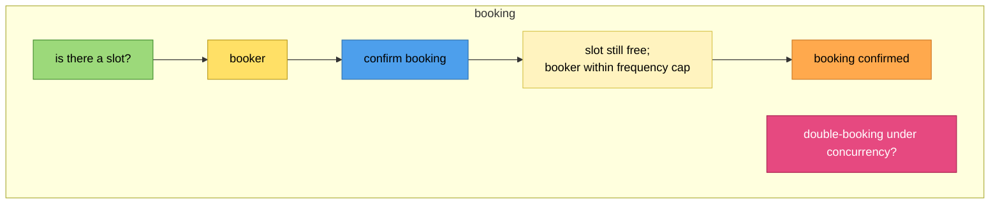

# Templates — drafts, diagrams, and the final spec

## Working files

Keep all interim artifacts in one folder, confirmed with the user at Stage 1 (default `feature-stormer/<feature-slug>/` at repo root):

```
feature-stormer/<feature-slug>/
  analysis.md          ← the living draft; accretes diagrams (Stage 6) then the plan (Stage 9)
  diagrams/            ← per-process .mmd + joined.mmd; SVGs land here too if needed (Stage 7)
```

The draft `analysis.md` is one growing document, not many files — written/updated on disk at each stage for *optional* review, while the actual review and gate happen in the terminal. At Stage 11, after the user approves the final version in the terminal, it is replaced by a single consolidated spec and the working folder is deleted (confirm first).

## Gap categories (Stage 3)

Probe each; record findings as **open questions**, never as resolved decisions:
- **Acceptance criteria** — what does "done" mean, observably? Vague or missing success conditions.
- **Scope boundaries** — what's in / out; which bounded contexts and actors are touched; what is explicitly *not* changing.
- **Test scenarios** — edge cases, failure/rejection paths, concurrency/idempotency, empty/limit cases, permissions.
- **Backward compatibility** — existing data, APIs, events, integrations, in-flight workflows that this could break.

## Draft analysis structure (Stage 4)

```markdown
# <Feature> — analysis (DRAFT)

## Task
<the task in the user's words; the branch: storming-supplied or task-only>

## Goal & business outcome
## Actors involved
## Scope
- In: …
- Out: …

## Assumptions
<each assumption explicit, so the user can correct it>

## Gaps & risks
### Acceptance criteria
### Scope boundaries
### Test scenarios
### Backward compatibility

## Open questions
1. … 2. …   ← these get asked in the terminal, not just left here
```

## Mermaid skeletons (Stages 5–6)

Always lead with the palette `classDef` block from `event-storming.md`. Give every node a unique id; quote labels containing spaces/punctuation.

**Per-process diagram** — one `subgraph` per business process:



The yellow node is a **constraint** — the list of conditions gating the command→event transition — never an aggregate noun. Model the rejection event too where a constraint can fail (e.g. `BK_EvRejected["booking rejected — slot taken"]`).

**Joined diagram** — every process as its own subgraph, with **dotted** cross-process edges (event → downstream policy/read model). This is the cross-boundary story:

```mermaid
flowchart TB
    %% palette classDef block here too
    subgraph BOOKING[booking] ... end
    subgraph REMINDER[reminder] ... end

    BK_EvConfirmed -.-> R_PolSchedule
```

Conventions: solid arrows inside a process (the legal grammar chain `read-model→actor→command→constraint→event` and `event→policy→command`); dotted arrows across processes. A read model feeds the **actor** who decides, not the command (unless the decision is automated, with no human actor). Never draw event→command or command→event directly (see the adjacency rules in `event-storming.md`). Prefix node ids per process (`BK_`, `R_`, …) to keep them unique in the joined view.

## SVG rendering (Stage 7)

Only if the user says the inline diagrams aren't readable. First reduce load by splitting the joined diagram into the per-process diagrams (often enough on its own). Then render SVGs:

```bash
bash <skill>/scripts/render-svg.sh feature-stormer/<slug>/diagrams/joined.mmd
```

The script tries `mmdc`, then `npx -y @mermaid-js/mermaid-cli`; if neither is available it prints fallbacks (open the `.mmd` in an IDE mermaid preview, or paste into mermaid.live). Don't block the pipeline on SVG tooling — readable inline diagrams or split diagrams are acceptable outcomes.

## Final consolidated spec (Stage 11)

One file replaces all drafts. Confirm the path with the user (default: `docs/<feature-slug>.md` if `docs/` exists, else `<feature-slug>-feature-spec.md` at repo root). It carries the three pillars:

```markdown
# <Feature> — feature specification

> Produced via feature-stormer: analysis → event storming → implementation plan. Approved <by whom / when, in the user's words>.

## 1. Analysis
<final task, goal, actors, scope, assumptions, and the gaps/risks with their now-resolved answers>

## 2. Event storming
<short domain-language narrative of the process (the forward read), then:>
### Per-process diagrams
<each mermaid diagram, with a one-line caption>
### Joined process
<the joined mermaid diagram>
### Decisions & resolved hotspots
<each former hotspot → the decision taken>
### Pivotal events & candidate context boundaries
<the 3–4 pivotal events; the bounded-context seams they suggest (technical homework)>
### Constraints & state machines
<the key constraints (business rules) and the state machines they imply — these become aggregates/archetypes, named in §3, not here>

## 3. Implementation plan
### Archetype analysis
<per-candidate fit verdicts (adopt/defer/reject) with sources — from archetypes.md>
### Reuse & extension
<existing code to extend; shared models; what is genuinely new>
### Generalization decisions
<each generalization idea → adopt now / defer / reject, with the reason>
### Backward compatibility & migration
<compatible? if not, the concrete migration plan>
### Testing strategy (local-first)
<the tests by type, and exactly how to run them locally; what (if anything) needs a deployed env>
### Work breakdown
<ordered, reviewable steps/milestones, anchored on pivotal events>
```

After writing and confirming the final file, delete the draft working folder (confirm before deleting). The repo should be left with one clean spec.
